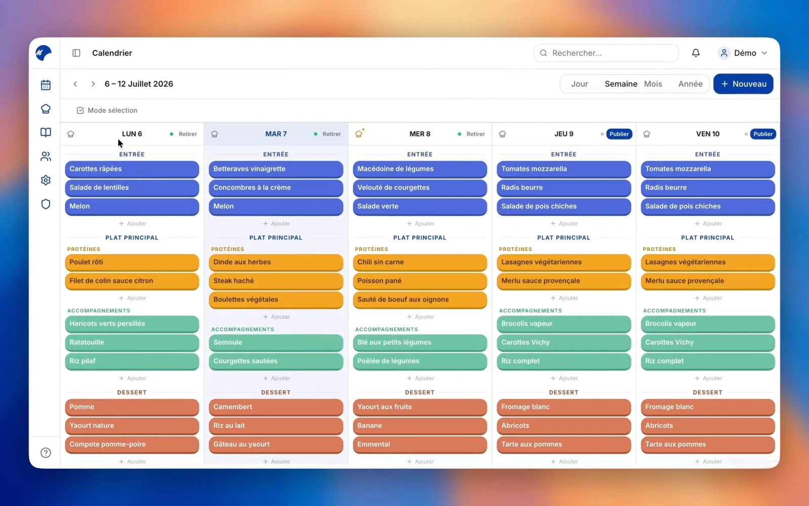

# Mariam

Menu management for university restaurants.

[](https://github.com/Tezay/mariam/actions/workflows/quality.yml)
[](https://github.com/Tezay/mariam/releases)
[](LICENSE.md)
[](https://mariam.app)

**English** | [Français](README.fr.md)

[](https://mariam.app)

## Overview

Mariam lets catering staff prepare and publish daily menus, and lets students read them on a phone
or on in-restaurant screens, without an account.

It is multi-tenant: an organization owns any number of sites, each with its own dashboard, public
page and data. Supervisors get a separate dashboard spanning every site they oversee. The same
analytics views serve both, scoped by role.

## Features

**For catering staff**

- Unified calendar with day, week, month and year views
- Dish catalogue with images, dietary labels, certifications and usage statistics
- CSV import and export, round-trip safe
- One-click publication, per day or per week
- Events, exceptional closures and a chef's note
- Real-time alerts, weekly email digest, per-user preferences

**For students**

- Mobile-first menu, no account required
- Full-screen display mode for in-restaurant screens
- Dietary labels and official certifications on every dish
- Three-level satisfaction vote, anonymous and fraud-resistant

**For supervisors**

- Cross-site overview: publication, traffic, satisfaction, site ranking
- Per-site drill-down on the same views
- Organization-wide dish catalogue, accounts and audit log

## Stack

| Layer | Technology |
|---|---|
| Frontend | React 18, TypeScript, Vite, Tailwind, shadcn/ui, Recharts, TanStack Query |
| Backend | Flask 3, flask-smorest, SQLAlchemy 2, Alembic, Gunicorn |
| Data | PostgreSQL 15, Redis 8, S3-compatible object storage |
| Infrastructure | Docker Compose, Nginx, GitHub Actions |

## Quick start

```bash
git clone https://github.com/Tezay/mariam
cd mariam
docker compose up -d --build
```

Frontend on `https://localhost:5173`, API on `http://localhost:5000`, OpenAPI at `/api/v1/docs`.
See [docs/INSTALL.md](docs/INSTALL.md) for production.

## Documentation

| Document | Contents |
|---|---|
| [docs/ARCHITECTURE.md](docs/ARCHITECTURE.md) | System design, multi-tenancy, data model |
| [docs/INSTALL.md](docs/INSTALL.md) | Production installation and configuration |
| [docs/OPERATIONS.md](docs/OPERATIONS.md) | Deployment, backups, monitoring, provisioning |
| [docs/API.md](docs/API.md) | REST reference |
| [docs/TESTING.md](docs/TESTING.md) | Test suites and how to run them |
| [CONTRIBUTING.md](CONTRIBUTING.md) | Development setup and conventions |
| [SECURITY.md](SECURITY.md) | Vulnerability reporting |
| [CHANGELOG.md](CHANGELOG.md) | Release history |

## Repository layout

```
client/   React frontend
server/   Flask backend, migrations, tests
deploy/   Production compose, Nginx, scripts
docs/     Technical documentation
```

## License

Source available, not open source: see [LICENSE.md](LICENSE.md). Non-commercial use is granted
under those terms; commercial use requires a separate agreement, see
[COMMERCIAL_LICENSE_TEMPLATE.md](COMMERCIAL_LICENSE_TEMPLATE.md).
